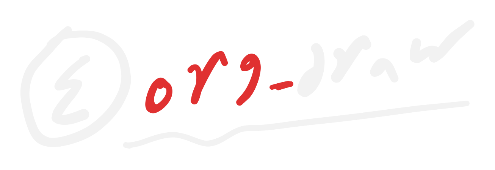

* org-draw
Seamless drawing into org-mode.

# [[https://img.shields.io/badge/license-GPLv3-blue.svg]] [[https://img.shields.io/badge/Emacs-28.1%2B-7F5AB6.svg]] [[https://img.shields.io/badge/canvas-tldraw-1e88e5.svg]] [[https://img.shields.io/badge/no%20app-just%20a%20browser-2ea44f.svg]]

org-draw lets you draw inside Org-mode using any device with a web browser and have the
result land in org-mode buffer as an inline, re-editable, portable figure.

Here's an example:

** Demo
:PROPERTIES:
:CUSTOM_ID: demo
:END:

[[https://www.youtube.com/watch?v=q_te8iX-Cjo][https://img.youtube.com/vi/q_te8iX-Cjo/0.jpg]]

[[file:figures/fig-20260814-204400.png]]

** Get started
:PROPERTIES:
:CUSTOM_ID: one-time-setup
:END:

=M-x org-draw= copies the
receiver URL to your clipboard. Open it on your machine or any device in your network.

If other people share your network and you don't want them reaching the server, set
=org-draw-require-pairing= to non-nil. Then the page shows a code-entry screen and
=org-draw-setup= prints a single-use 6-digit code to type in (it expires after 5 wrong
attempts).

The drawing surface is [[https://github.com/tldraw/tldraw][tldraw]]. tldraw is loaded from a CDN, so the device needs internet access the first time it opens the page (on an offline network the page shows a clear message
instead of a blank screen).

** Customization
:PROPERTIES:
:CUSTOM_ID: customization
:END:

- =org-draw-port= (default =8777=)
- =org-draw-directory= (default ="figures"=)
- =org-draw-file-name-function= (default =org-draw-default-file-name=)
- =org-draw-insert-attr-width= (default =nil=) when set to an integer pixel
  width, org-draw inserts a =#+ATTR_ORG: :width N= line above the link to a
  newly created figure, so it displays at a fixed width inline. Leave it =nil=
  to skip the ATTR line entirely.
- =org-draw-require-pairing= (default =nil=) whether a browser must enter a
  6-digit code before it can draw. Off by default (any browser on your LAN can
  receive drawings). Set to non-nil on a shared network to require pairing.
- =org-draw-token-file= (default =<user-emacs-directory>/org-draw-tokens=) where
  paired-device tokens are stored (only used when =org-draw-require-pairing= is on)
- =org-draw-figure-background= (default =transparent=) the background baked
  behind a figure's ink in the exported PNG. =transparent= keeps true ink
  colors and shows the figure against your org buffer's background (so a white
  pen shows in a dark theme and a black pen in a light theme); or set it to
  =white=, =dark=, or a CSS color string to bake that behind every figure.
- =org-draw-web-canvas-file= path to the web canvas HTML served at =/canvas=
  (defaults to =web/canvas.html= shipped with the package).
- =org-draw-web-open-function= (default =nil=) when non-nil (e.g. =browse-url=),
  =org-draw= also opens the per-session =/canvas= URL on the machine
  running Emacs, in addition to the receiver tab picking it up. Leave =nil= to
  rely solely on the open receiver tab.

** License
:PROPERTIES:
:CUSTOM_ID: license
:END:
GPL-3.0-or-later. See [[file:LICENSE]].
